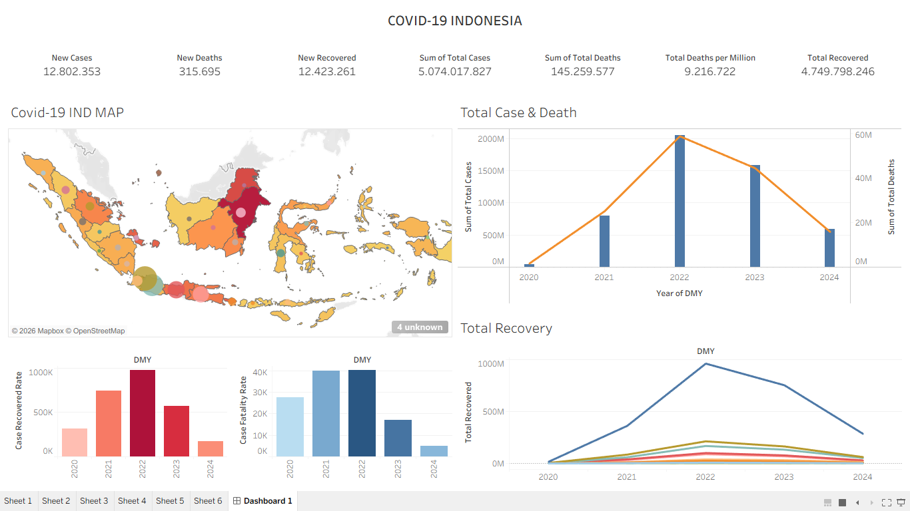

# 📊 COVID 19 Indonesia Analytics Dashboard

[An interactive Dashboard Public]

(https://public.tableau.com/shared/5TPHG2BF2?:display_count=n&:origin=viz_share_link)


## 🚀 Overview

Building an **COVID 19 Indonesia Analytics Dashboard** An interactive Tableau dashboard visualizing COVID-19 pandemic data across Indonesian provinces from 2020 to 2024.
This dashboard provides a comprehensive summary of Indonesia COVID-19 data at both national and regional levels, covering:

| Metric | Value |
|---|---|
| New Cases | 12,802,353 |
| New Deaths | 315,695 |
| New Recovered | 12,423,261 |
| Sum of Total Cases | 5,074,017,827 |
| Sum of Total Deaths | 145,259,577 |
| Total Deaths per Million | 9,216,722 |
| Total Recovered | 4,749,798,246 |


> 📌 Designed with interactivity, clarity, and real-world decision-making in mind, this dashboard empowers analysts, managers, and stakeholders to unlock the *why* behind the numbers.

---

## 🛠️ Tools & Technologies

- **Tableau** — Primary data visualization platform
- **Mapbox / OpenStreetMap** — Interactive map of Indonesian regions
- **Data Source** — [Indonesia COVID-19 public dataset (2020–2024)](https://www.kaggle.com/datasets/hendratno/covid19-indonesia)

---

## 📊 Visualizations

This dashboard consists of 6 analytical sheets and 1 main dashboard view:

```
Sheet 1   — (Distribution Map)
Sheet 2   — (Total Cases & Deaths)
Sheet 3   — (Total Recovery)
Sheet 4   — (Case Recovered Rate)
Sheet 5   — (Case Fatality Rate)
Sheet 6   — (Additional Analysis)
Dashboard 1 — Main Integrated View

---

## 🗂️ Dashboard Features

## 🗺️ COVID-19 Indonesia Map
An interactive map displaying the distribution of COVID-19 cases across Indonesian provinces. Color intensity and marker size reflect the severity level in each region.

## 📈 Total Cases & Deaths (by Year)
A combination chart (bar + line) showing the trend of total cases and deaths from 2020–2024. The pandemic peak is clearly visible in **2022**.

## 💚 Total Recovery
A multi-line chart displaying recovery trends by category from 2020–2024, with the highest peak in 2022 followed by a decline as the pandemic subsided.

## 📉 Case Recovered Rate
A bar chart illustrating the annual recovery rate, reflecting the healthcare systems capacity to handle COVID-19 patients over time.

## ⚠️ Case Fatality Rate
A bar chart showing the relative death toll against total cases each year, serving as an indicator of the virus's lethality over time.

---

## 💡 Key Insights

- **2022** recorded the highest peak of cases and deaths in Indonesia.
- After 2022, both case and death trends declined significantly through 2024.
- The national recovery rate remains high, reflecting the overall effectiveness of medical response efforts.
- Case distribution is uneven — provinces in **Java** dominate the national total case count.

---

## 🛠️ Tools & Technologies Used

| Tool          | Purpose                            |
|---------------|------------------------------------|
| **Tableau**   | Visualization & Dashboard Building |
| **MS Excel**  | Data Cleaning & Structuring        |
| **Kaggle**    | Source of Retail Dataset           |

---
